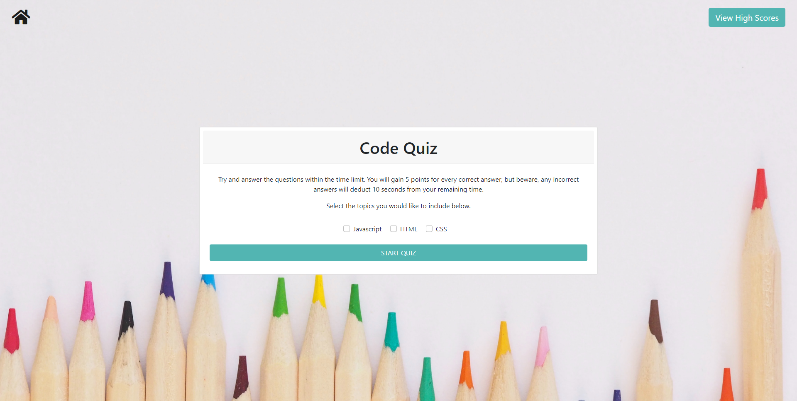
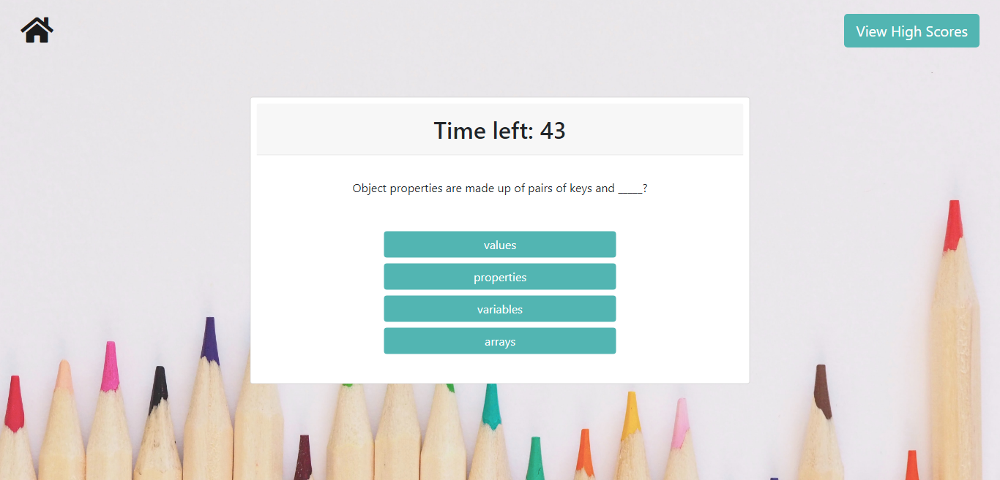

<h1>Code Quiz</h1>

  <h2> Table of Contents </h2>

- [Project Link](#project-link)
- [About the Project](#about-the-project)
- [Plans for Improvement](#plans-for-improvement)
- [Screenshots](#screenshots)

## Project Link

Click [here](https://natasha-mann.github.io/code_quiz/) to view the project on GitHub pages.

## About the Project

For this project I created a code quiz. I coded this application from scratch and built up the HTML, CSS and Javascript accordingly.

The quiz currently contains 5 questions, but the code is flexible so more questions can be added with ease. To start the quiz, the user must click a button which then triggers a timer and displays the first question on screen. The user is alerted to whether their answer was correct or incorrect by a change in colour of the answer button. The user gains 5 points for each correct answer and for each wrong answer, 10 seconds are deducted from the timer. When the timer reaches 0 or all questions have been answered, the quiz ends.

The final score is calculated from total points scored plus the time remaining on the clock. On the "game over" screen, the user is asked to enter their initials and save their score. This is saved in local storage and will be displayed on the leader board, with the highest recorded score at the top. The user can then click a button to clear the local storage if they wish, and return to the game.

## Plans for Improvement

If I had time to work on this project further, there are a few elements I would like to change or add. Primarily, I would aim to implement the following features:

- Lock the answer selectors so that only one choice can be chosen per question.
- Refactor the Javascript to implement jQuery framework.
- Add sound effects to highlight if the selected answer is correct or incorrect.
- Additional questions to be added

## Screenshots

