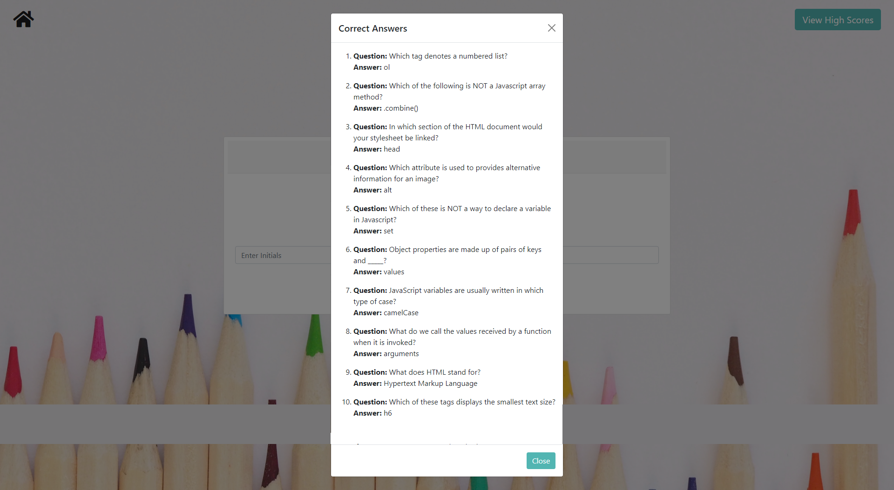

<h1>Code Quiz</h1>

<h2> Table of Contents </h2>

- [Getting Started](#getting-started)
- [Project Link](#project-link)
- [About the Project](#about-the-project)
- [Screenshots](#screenshots)

## Getting Started

```
git clone https://github.com/natasha-mann/code_quiz.git
cd code_quiz
code .
```

## Project Link

Click [here](https://natasha-mann.github.io/code_quiz/) to view the project on GitHub pages.

## About the Project

This app was built using HTML, CSS (Bootstrap) and Javascript (jQuery).

- User can select from different topics to include in the quiz using checkboxes.
- Questions are dynamically generated based on the user's choice and are presented in a random order for each quiz.
- A timer is dynamically generated based on the number of questions in the quiz.
- The answer selected will change to red for incorrect and green correct.
- 5 points are allocated per correct answer and 10 seconds are deducted for an incorrect answer.
- Quiz ends when all questions are answered OR timer reaches 0.
- Final score equals time left plus accumulated correct answer points.
- When the quiz has ended, the user can choose to view all the correct answers and this is displayed in a modal.
- User can enter initials and save their score in local storage.
- The highscores page displays all saved initials and scores, with the highest recorded score at the top.
- User can then clear all local storage if they wish.

## Screenshots




